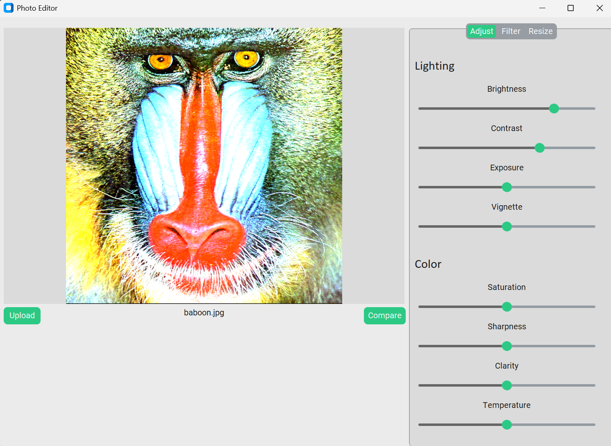

# 📸 PhotoEnhancer

PhotoEnhancer is a simple desktop application built using **OpenCV** and **Tkinter** that allows users to enhance images with a variety of tools and filters. It provides a user-friendly interface to load, edit, and save images with ease.
## 📸 Screenshot


## 🛠 Features

- Load and display images
- Adjust brightness and contrast
- Apply filters (grayscale, blur, sharpen, edge detection, etc.)
- Resize and crop images
- Save enhanced images to disk
- Undo/Redo functionality (optional)
- Real-time preview of enhancements

## 🚀 Getting Started

### Prerequisites

Make sure you have the following installed:

- Python 3.7+
- OpenCV
- Tkinter (usually included with Python)
- NumPy

### Installation

1. **Clone the repository:**

```bash
git clone https://github.com/AMAYKJHA/PhotoEditor.git
cd PhotoEditor
